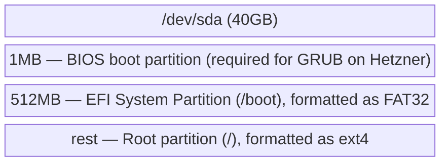
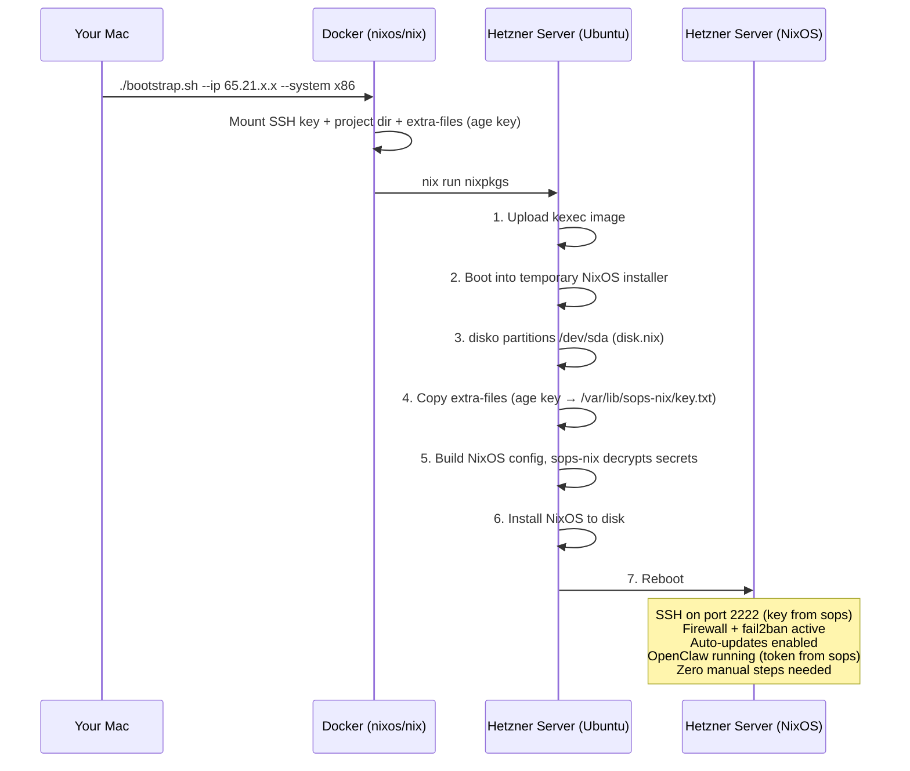
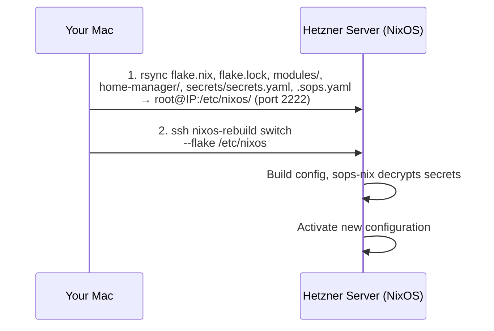

# Architecture: Reproducible NixOS VPS

## Overview

```mermaid
graph TD
    subgraph Mac["Your Mac (no Nix installed)"]
        Repo["dagadbm-vps/"]
        Flake["flake.nix"]
        Scripts["bootstrap.sh / update.sh"]
        SopsSecrets["secrets/secrets.yaml<br/>(encrypted, in git)"]
        AgeKey["secrets/age-key.txt<br/>(gitignored)"]

        Scripts -->|install mode| Docker["Docker container<br/>(nixos/nix image)<br/>runs nixos-anywhere"]
        Scripts -->|switch mode| Rsync["rsync + SSH<br/>(no Docker needed)"]
    end

    Docker -->|SSH + extra-files<br/>(age key)| Server
    Rsync -->|SSH| Server

    subgraph Server["Hetzner Cloud VPS"]
        Install["Install: Ubuntu → nixos-anywhere → NixOS"]
        Update["Update: rsync Nix files → nixos-rebuild switch"]

        subgraph NixOS
            subgraph SopsNix["sops.nix"]
                SN1["Age key at /var/lib/sops-nix/key.txt"]
                SN2["Decrypts to /run/secrets/ (tmpfs)"]
            end

            subgraph SecurityMod["security.nix"]
                S1["SSH on port 2222"]
                S2["Key-only auth"]
                S3["Firewall (2222, 443)"]
                S4["fail2ban SSH jail"]
                S5["Auto-updates"]
            end

            subgraph OpenClawMod["openclaw.nix"]
                O1["Home Manager module"]
                O2["official nix-openclaw"]
                O3["systemd user service"]
                O4["openclaw-gateway"]
            end

            Users["Users:<br/>- root (SSH key from sops)<br/>- openclaw (service user, SSH key from sops)"]
        end
    end
```

## File Structure

```
dagadbm-vps/
├── flake.nix                  # Dependency declarations (nixpkgs, disko, nix-openclaw, home-manager, sops-nix)
├── flake.lock                 # Pinned versions (auto-generated, committed to git)
├── bootstrap.sh               # First install script (destructive, provisions age key)
├── update.sh                  # Config update script (syncs secrets + config)
├── .sops.yaml                 # sops config — age public key + creation rules
├── modules/
│   ├── disk.nix               # Disk partitioning layout for disko
│   ├── system.nix             # Main NixOS config (users, bootloader, Home Manager)
│   ├── security.nix           # SSH, firewall, fail2ban, auto-updates
│   └── sops.nix               # sops-nix secret management (age key, secret declarations)
├── home-manager/
│   └── openclaw.nix           # OpenClaw via Home Manager + nix-openclaw
├── secrets/
│   ├── secrets.yaml           # Encrypted secrets (committed to git)
│   └── age-key.txt            # Age private key (gitignored — NEVER commit)
├── specs/
└── .gitignore
```

## Component Details

### flake.nix — The Dependency Manager

Think of this as a `package.json` for the entire operating system.

All modules are loaded flat from `flake.nix` — no module imports another sibling module.

**Inputs** (dependencies):
| Input | What it is | Why we need it |
|-------|-----------|----------------|
| `nixpkgs` | The NixOS package collection | Base packages and NixOS modules |
| `disko` | Declarative disk partitioning | So nixos-anywhere can format the drive |
| `home-manager` | Per-user config management | Required by official nix-openclaw |
| `nix-openclaw` | Official OpenClaw Nix package | Installs and runs OpenClaw |
| `sops-nix` | Encrypted secret management | Auto-decrypts secrets at activation time |

**Outputs**: Two NixOS configurations:
- `vps-x86` (`x86_64-linux`)
- `vps-arm` (`aarch64-linux`)

### modules/disk.nix — Disk Layout

Tells disko how to partition the Hetzner server's disk:



GRUB is used instead of systemd-boot because Hetzner Cloud VMs require it.

### modules/system.nix — The System Recipe

Base NixOS configuration:
- Sets hostname, timezone, locale
- Creates user accounts (root for admin, openclaw for the service)
- SSH authorized keys loaded from sops secret (`ssh-public-key`)
- Imports Home Manager as a NixOS module
- Enables GRUB bootloader
- Allows unfree packages if needed

### modules/security.nix — Hardening

| Feature | Setting | Why |
|---------|---------|-----|
| SSH port | 2222 | Avoids bulk scanners targeting port 22 |
| Password auth | Disabled | Only SSH keys accepted |
| Root login | Key-only | Needed for nixos-rebuild, but no password |
| Firewall | Ports 2222 + 443 only | Block everything else |
| fail2ban | SSH jail, 5 retries, incremental bans | Stops brute-force scanners |
| Auto-updates | Daily | Keeps security patches current |

### modules/sops.nix — Secret Management

Uses a standalone age key (not derived from SSH host keys) so VPS instances are fully disposable — no `sops updatekeys` needed when creating/destroying servers.

| Setting | Value | Why |
|---------|-------|-----|
| `age.keyFile` | `/var/lib/sops-nix/key.txt` | Provisioned by bootstrap |
| `age.sshKeyPaths` | `[]` | Disable SSH key derivation |
| `defaultSopsFile` | `../secrets/secrets.yaml` | Encrypted file in repo |

**Declared secrets**:
| Secret | Owner | Notes |
|--------|-------|-------|
| `gateway-token` | `openclaw` | OpenClaw API token, mode 0400 |
| `ssh-public-key` | root | `neededForUsers = true` — decrypted before user creation |

### home-manager/openclaw.nix — OpenClaw Service

Uses the official `nix-openclaw` Home Manager module:
- Gateway runs as systemd user service under the `openclaw` user
- Binds to localhost (not exposed to internet directly)
- API token loaded from `/run/secrets/gateway-token` (sops-managed)
- State stored in `/home/openclaw/.openclaw/`

### bootstrap.sh + update.sh — Deploy Workflow

```
./bootstrap.sh --host <HOST> --system <x86|arm>  # First install (wipes disk)
./update.sh --host <HOST> --system <x86|arm>     # Config update
```

No local Nix required.

**Install mode** (`bootstrap.sh`):
1. Validates SSH key and age key (`secrets/age-key.txt`)
2. Prepares extra-files directory with age key at `/var/lib/sops-nix/key.txt`
3. Runs a `nixos/nix` Docker container that executes `nixos-anywhere`
4. Mounts the SSH key, project directory, and extra-files into the container
5. Uses `--extra-files` to provision the age key to the new system
6. Waits for reboot, runs `update.sh` to ensure full config, optimises Nix store

**Switch mode** (`update.sh`):
1. Uses rsync to sync Nix files (`flake.nix`, `flake.lock`, `modules/`, `home-manager/`, `secrets/secrets.yaml`, `.sops.yaml`) to `/etc/nixos/` on the server
2. SSHs in and runs `nixos-rebuild switch --flake /etc/nixos#vps-x86` or `...#vps-arm`
3. sops-nix decrypts secrets during activation — no manual steps

### secrets/ — Encrypted Secrets

Secrets are managed via sops-nix with age encryption:
- `secrets/secrets.yaml` — encrypted, committed to git. Contains `gateway-token` and `ssh-public-key`.
- `secrets/age-key.txt` — age private key, gitignored. The only key that can decrypt secrets.
- `.sops.yaml` — sops config at repo root, references the age public key.

The age key is provisioned to the server during bootstrap via nixos-anywhere's `--extra-files`. It lands at `/var/lib/sops-nix/key.txt`. Secrets are decrypted to `/run/secrets/` (tmpfs) during NixOS activation.

## Deployment Flows

### First Install



### Config Update



## Technology Choices

| Decision | Choice | Alternatives considered | Why this one |
|----------|--------|------------------------|--------------|
| Deployment tool | nixos-anywhere | nixos-infect | Clean, declarative, not a hack |
| Disk partitioning | disko | Manual partitioning | Declarative, integrated with nixos-anywhere |
| Bootloader | GRUB | systemd-boot | Hetzner Cloud requires GRUB |
| OpenClaw install | Official nix-openclaw | Scout-DJ/openclaw-nix, Docker | Official, maintained by OpenClaw team |
| User management | Home Manager | NixOS system module | Required by official nix-openclaw |
| Secrets | sops-nix with age key | .gitignored directory, agenix | Encrypted in git, auto-decrypted, no per-host key management |
| Local Nix runtime | Docker (nixos/nix image) | Install Nix on Mac | No Mac-side Nix install needed; Docker is ephemeral |
| Config updates | rsync + SSH | nixos-rebuild --target-host | No local Nix needed; rsync ships with macOS |
