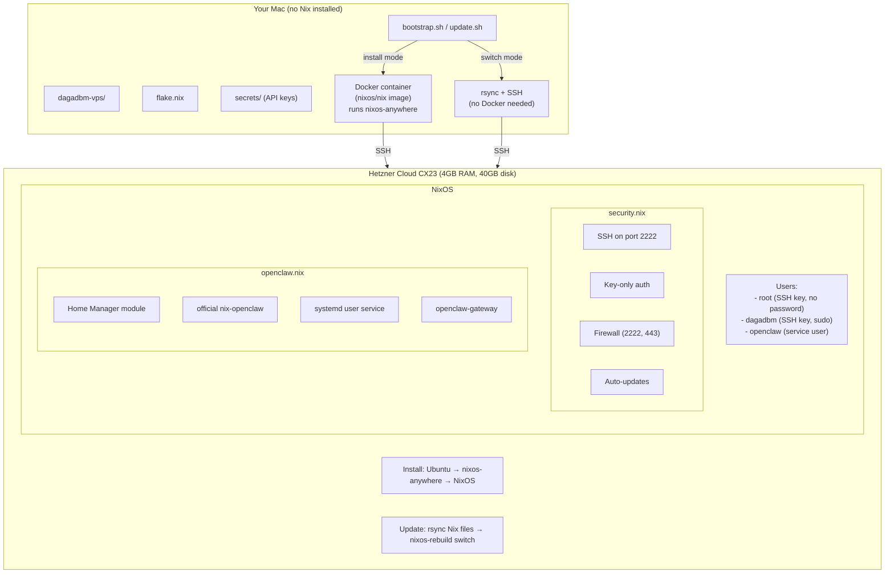
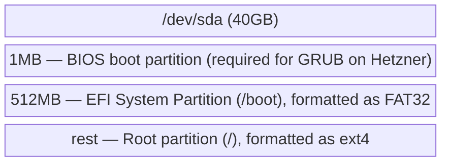
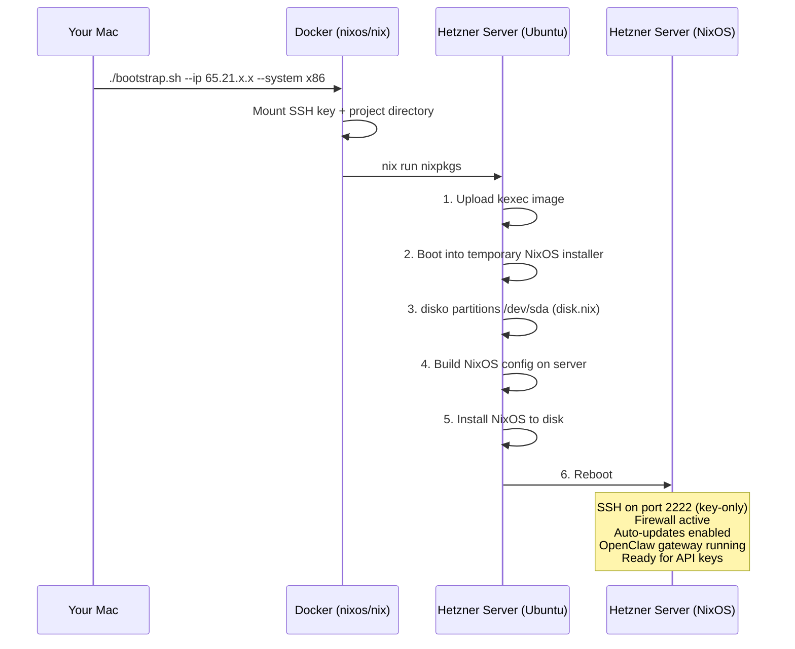
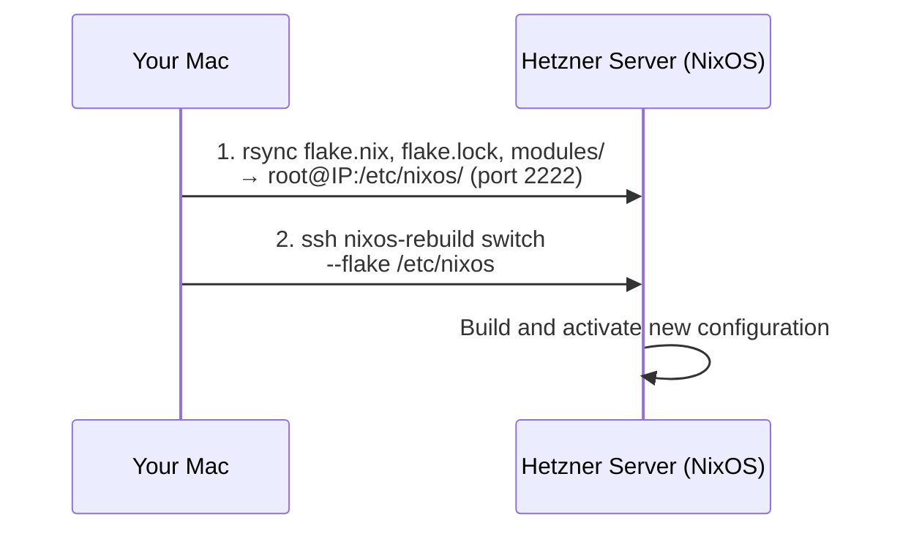

# Architecture: Reproducible NixOS VPS

## Overview



## File Structure

```
dagadbm-vps/
├── flake.nix                  # Dependency declarations (nixpkgs, disko, nix-openclaw, home-manager)
├── flake.lock                 # Pinned versions (auto-generated, committed to git)
├── bootstrap.sh               # First install script (destructive)
├── update.sh                  # Config update script
├── modules/
│   ├── disk.nix               # Disk partitioning layout for disko
│   ├── system.nix             # Main NixOS config (imports other modules)
│   └── security.nix           # SSH, firewall, auto-updates
├── home-manager/
│   └── openclaw.nix           # OpenClaw via Home Manager + nix-openclaw
├── secrets/                   # .gitignored — API keys, tokens
│   └── .gitkeep
├── specs/                      
└── .gitignore
```

## Component Details

### flake.nix — The Dependency Manager

Think of this as a `package.json` for the entire operating system.

**Inputs** (dependencies):
| Input | What it is | Why we need it |
|-------|-----------|----------------|
| `nixpkgs` | The NixOS package collection | Base packages and NixOS modules |
| `disko` | Declarative disk partitioning | So nixos-anywhere can format the drive |
| `home-manager` | Per-user config management | Required by official nix-openclaw |
| `nix-openclaw` | Official OpenClaw Nix package | Installs and runs OpenClaw |

**Outputs**: Two NixOS configurations:
- `vps-x86` (`x86_64-linux`)
- `vps-arm` (`aarch64-linux`)

### modules/disk.nix — Disk Layout

Tells disko how to partition the Hetzner server's disk:



GRUB is used instead of systemd-boot because Hetzner Cloud VMs require it.

### modules/system.nix — The System Recipe

Base NixOS configuration:
- Sets hostname, timezone, locale
- Creates user accounts (dagadbm with sudo, openclaw for the service)
- Imports Home Manager as a NixOS module
- Imports security.nix and openclaw.nix
- Enables GRUB bootloader
- Allows unfree packages if needed

### modules/security.nix — Hardening

| Feature | Setting | Why |
|---------|---------|-----|
| SSH port | 2222 | Avoids bulk scanners targeting port 22 |
| Password auth | Disabled | Only SSH keys accepted |
| Root login | Key-only | Needed for nixos-rebuild, but no password |
| Firewall | Ports 2222 + 443 only | Block everything else |
| Auto-updates | Daily | Keeps security patches current |
| fail2ban | Not yet | Added later to avoid lockouts while learning |

### modules/openclaw.nix — OpenClaw Service

Uses the official `nix-openclaw` Home Manager module:
- `programs.openclaw.enable = true`
- Gateway runs as systemd user service under the `openclaw` user
- Binds to localhost (not exposed to internet directly)
- State stored in `/home/openclaw/.openclaw/`
- API keys loaded from `/home/openclaw/secrets/`

### bootstrap.sh + update.sh — Deploy Workflow

```
./bootstrap.sh --host <HOST> --system <x86|arm>  # First install (wipes disk)
./update.sh --host <HOST> --system <x86|arm>     # Config update
```

No local Nix required.

**Install mode** (`bootstrap.sh`):
1. Checks Docker is installed and running
2. Runs a `nixos/nix` Docker container that executes `nixos-anywhere`
3. Mounts the SSH key and project directory into the container
4. Uses `--flake /work#vps-x86` with `--system x86` or `--flake /work#vps-arm` with `--system arm`
5. Prints post-install steps

**Switch mode** (`update.sh`):
1. Uses rsync to sync Nix files (`flake.nix`, `flake.lock`, `modules/`) to `/etc/nixos/` on the server
2. SSHs in and runs `nixos-rebuild switch --flake /etc/nixos#vps-x86` or `...#vps-arm`
3. Only needs rsync and SSH (both pre-installed on macOS)

### secrets/ — Your API Keys

`.gitignored` directory where you store:
- Anthropic API key (for OpenClaw's LLM access)
- Optional: Telegram bot token, Discord bot token
- Optional: any other service credentials

These get manually copied to the server after deploy. Future improvement: use sops-nix to encrypt them in the repo.

## Deployment Flows

### First Install



### Config Update



## Technology Choices

| Decision | Choice | Alternatives considered | Why this one |
|----------|--------|------------------------|--------------|
| Deployment tool | nixos-anywhere | nixos-infect | Clean, declarative, not a hack |
| Disk partitioning | disko | Manual partitioning | Declarative, integrated with nixos-anywhere |
| Bootloader | GRUB | systemd-boot | Hetzner Cloud requires GRUB |
| OpenClaw install | Official nix-openclaw | Scout-DJ/openclaw-nix, Docker | Official, maintained by OpenClaw team |
| User management | Home Manager | NixOS system module | Required by official nix-openclaw |
| Secrets | .gitignored directory | sops-nix, agenix | Simple for now, upgradable later |
| Local Nix runtime | Docker (nixos/nix image) | Install Nix on Mac | No Mac-side Nix install needed; Docker is ephemeral |
| Config updates | rsync + SSH | nixos-rebuild --target-host | No local Nix needed; rsync ships with macOS |
